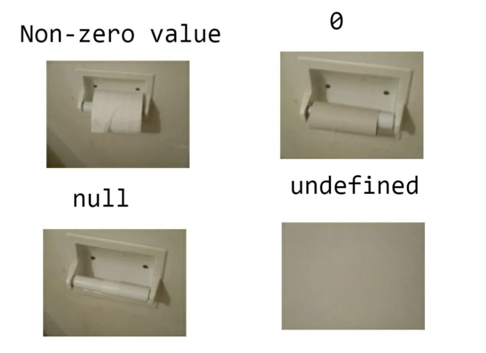
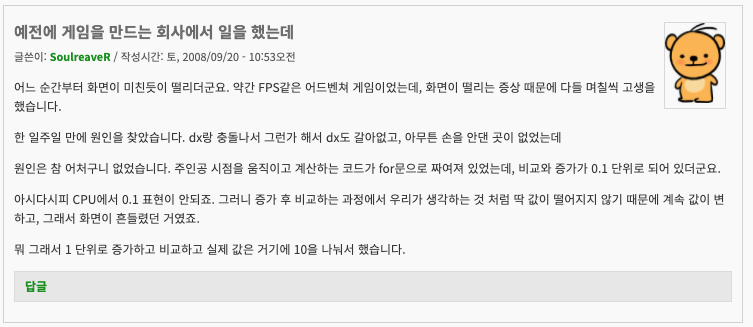

## 1. 식별자(Identifier, ID)

### 1.1 명명 규칙(네이밍 컨벤션)

#### Rule ID-1-1(권장): 식별자는 영어 알파벳, 숫자, 언더바 만을 사용해야 합니다.

JavaScript와 이의 상위 버전인 TypeScript는 식별자로 알파벳 뿐만 아니라 유니코드를 사용할 수 있습니다!(참고: [TC39 ECMA262](https://tc39.es/ecma262/#prod-IdentifierStartChar)) 즉 한글도 식별자로 사용할 수 있다는 말입니다. 예를 들어 아래 코드는 문법적으로 완벽하고 실제로 동작합니다.

```ts
const 인사말 = '안녕';
console.log(인사말);
```

영어권이라면 이 규칙은 "권장"이 아니라 "필수"가 되었을텐데, 안타깝게도 저희는 한국어권에서 살고 있습니다. 하지만 영어 알파벳, 숫자, 언더바 만을 사용하길 권장합니다. 하지만 개인적으로는 한글 용어를 억지로 영어 변수로 만들어서 가독성 및 유지보수성이 떨어질때는 과감하게 한글 식별자도 고려해보셨으면 합니다.

예를 들어 ISA 계좌에서 사용자에게 `일반 과세시 과표`, `미징수 보수/세금액`, `중도인출가능금액`, `세제혜택시 과표`를 알려줘야할때 이 식별자는 어떻게 영어로 표현할까요? 과거 프로그래머 유머에 단골로 등장하는 `gubun`, `gwapyo`라는 변수명이 언제나 나쁘다고 생각하진 않습니다.(그렇게 써본적은 없지만...)

```ts
const 일반과세시_과표 = 123;
const 미징수_보수_세금액 = 456;
```

예외: jQuery의 변수처럼 전위에 붙는 `$`와 `Observable`을 표기하기 위한 일반적으로 사용하는 방식인 후위에 붙는 `$`가 있습니다. 프로젝트 별로 규칙이 일관되고 합의만 된다면 `$`는 허용합니다.

#### Rule ID-1-2(필수): 모든 식별자는 카멜 케이스, 파스칼 케이스를 따릅니다

현업에서 통용되는 네이밍 컨벤션, 즉 명명 규칙(관습)은 크게 4가지로 정의할 수 있습니다.

```ts
const camelCase = 1; // 카멜 케이스. 첫 글자 소문자, 구분하고자 하는 단어 첫 글자는 대문자
const PascalCase = 2; // 파스칼 케이스. 첫 글자 대문자, 구분하고자 하는 단어 첫 글자도 대문자
const snake_case = 3; // 스네이크 케이스. 모든 글자 소문자, 구분하고자 하는 단어 앞에 _
const nHungarianCase = 4; // 헝가리안 케이스. prefix가 이 변수의 타입을 의미
```

이 중, JavaScript에서 주로 사용하는 카멜 케이스와 파스칼 케이스로 식별자의 이름을 지어야 합니다. 아래는 각 네이밍 컨벤션이 적용되는 식별자 종류입니다.

| 컨벤션 종류 | 식별자 종류                                |
| ----------- | ------------------------------------------ |
| PascalCase  | 클래스, 인터페이스, type, enum, 데코레이터 |
| camelCase   | 변수, 매개변수, 함수, 메서드, 속성         |

예외: 글로벌 상수의 경우 Rule ID-1-3처럼 별도의 명명규칙을 따릅니다.

### 1.2 용도에 따른 명명 규칙

#### Rule ID-2-1(권장): 글로벌 상수는 대문자와 밑줄(언더바)로 이루어져야 합니다.

코드를 작성하다보면 어떠한 값은 불변(Immutable)하는 값이 있습니다.

```ts
const ONE_HOUR_IN_MS = 60 * 60 * 1000;
```

1시간을 밀리초로 표현한 값은 사실상 불변 값입니다. 이 경우 변수 이름은 대문자와 언더바로만 구성되어야 합니다. 물론 위의 코드처럼 원시 타입이 아닌 객체 리터럴인 경우에는 아래처럼 기술적으로 수정할 수는 있습니다.

```ts
const CPP_INVENTOR = {
  name: 'Bjarne Stroustrup',
  job: 'Professor',
  id: 1,
};

MASTER_USER.name = 'Dennis Ritchie'; // 수정은 가능하다
```

다만 글로벌 상수를 대문자와 언더바로만 구성하는 이유는 이 코드를 읽는 사람에게 이 값의 의도는 불변 값이라는 사실을 알려주고자 함이며, 함부로 수정하지 말라는 경고이기도 합니다.

클래스 내부에서만 사용할 때도 동일한 규칙을 적용하시길 권장합니다.

```ts
class SomeClass {
  private readonly THRESHOLD_NUM = 573;
  // ....
}
```

#### Rule ID-2-2(권장): `Array<T>`와 같은 타입 매개변수는 대문자 영문 알파벳 한 글자 혹은 Pascal Case를 사용하세요.

정해진 규칙은 없습니다만 보통 타입 매개변수로 `T`, `U` 등을 많이 사용합니다. 가능하면 대문자 영문 알파벳 한 글자를 사용하시거나 Pascal Case 를 사용하시기 바랍니다.

```ts
function someFunc<T extends number>(n: T): number {
  return n + 1;
}
```

#### Rule ID-2-3(권장): 전위(Prefix) 언더바, 후위(Suffix) 언더바는 사용하지 말아야 합니다.

식별자의 이름으로 후위 언더바 혹은 전위 언더바를 사용하지 말아야 합니다. 언더바가 앞 혹은 뒤에 붙은 식별자는 명시적으로 해당 식별자는 사용하지 않는다는 것을 의미하기 때문입니다. (보통 전위 언더바를 사용합니다)

```ts
try {
  swingLightSaver();
} catch (_err: unknown) {
  // err을 사용하지 않음
  throw new Error("I'm your father");
}

const { some, _unused, variable } = obj;
```

예외: 위의 코드처럼 명시적으로 사용하지 않는 매개변수나 구조분해를 받는 변수를 표기하기 위해서라면 경우에는 사용 가능합니다.

#### Rule ID-2-4(권장): 식별자에 의미를 충분히 담아야 합니다.

식별자는 그 자체로서 의미를 잘 전달할 수 있어야 합니다. 특히 약어(Abbreviation)에 주의하셔야 합니다.

아래는 변수명으로서 안 좋은 예입니다.

```ts
const whId = 1; // 내부에서만 사용하는 약어
const n = 1; // 의미 없음
const nErr = 1; // 모호한 약어
const pcCounter = 1; // pc라는 약어에는 많은 의미가 있음
```

아래는 좋은 예입니다.

```ts
const targetIp = '192.168.0.1'; // "IP"는 모두가 다 아는 약어
const errorCount = 1; // 명확한 의미
const warehouseId = 1; // 명확함
```

예외: 10~15 줄 내의 작은 범위(Scope)에서 사용하거나 외부로 노출되지 않는 메서드, 변수의 인자명으로 쓸 경우 `n`, `i` 와 같이 짧은 변수명은 허용 가능하지만 해당 범위 내의 코드가 늘어날 경우 다시 의미가 모호해질 가능성이 있다는 점 유의하셔야 합니다.

## 2. 타입(Types, TP)

### 2.1 원시 타입(Primitive Type)

#### Rule TP-1-1(필수): 원시 타입(Primitive Type)은 래퍼(Wrapper) 객체를 사용하지 마세요.

TypeScript에서는 원시 타입(`string`, `number`, `boolean`, `symbol`)에 대한 래퍼 클래스(`String`, `Number`, `Boolean`, `Symbol`)를 제공합니다. `hi` 라는 문자열로 변수를 초기화할 때 아래와 같이 사용할 수 있습니다.

```ts
const greeting1 = 'hi';
const greeting2 = new String('hi');
```

하지만 래퍼 객체를 사용할 경우 몇 가지 문제점이 있습니다.

첫 번째, 예상치 못한 동작을 마주할 수 있습니다. 예를 들어 아래 코드를 살펴보겠습니다.

```ts
const str1: string = 'hello';
const str2: String = new String('hello');

console.log(typeof str1); // "string"
console.log(typeof str2); // "object"
```

`typeof` 연산자를 썼을 때 값이 다르다는 것을 확인할 수 있습니다.

더 큰 문제는 아래와 같은 비교연산자를 사용할 때인데, 코드를 작성한 이는 당연히 `str1`과 `str2`이 같다고 인지하겠지만 결과는 다릅니다.

```ts
console.log(str1 === str2); // false
```

두 번째, 메모리와 성능 문제

래퍼 객체는 객체이기 때문에 원시형에 비해 더 많은 메모리를 소비하며, 객체를 생성하고 관리(가비지 컬렉션 등)하는 오버헤드 때문에 원시형에 비해 느립니다. TypeScript가 래핑하고 있는 JavaScript는 필요할 때 자동으로 원시값을 임시 객체로 래핑하기에, 원시값에서도 메서드를 직접 호출할 수 있어 래퍼 객체가 불필요합니다.

```ts
const someStr = ' hello ';
console.log(someStr.trim());
```

세 번째, 타입 시스템에 혼란을 야기할 수 있습니다.

아래 예를 보시겠습니다. 프로그래머는 `string`형과 `String`형을 동일하게 취급한다고 가정하고 코드를 작성했습니다.

```ts
function printLength(value: string) {
  console.log(value.length);
}

printLength('hello'); // 정상 동작
printLength(new String('hello')); // 컴파일 에러
```

위 코드에서는 두 번째 `printLength()` 호출 시 컴파일 에러가 발생합니다. 이를 고치려면 아래와 같이 불필요하고 번거롭게 타입 정의를 해야합니다.

```ts
function printLength(value: string | String) {
  console.log(value.length);
}
```

TypeScript는 원시 타입 사용을 기본으로 하고 있습니다. 따라서 래퍼 객체를 사용하면 코드의 타입 안전성과 가독성이 저하될 수 있습니다.

#### Rule TP-1-2(필수): `Object`타입과 `Object` 생성자를 사용하지 마세요.

`Object`는 단순히 `{ a: 1, b: 2}`와 같은 객체(object) 래퍼 타입 같지만 실질적으로는 더 느슨한 타입이며 실상은 `any`에 가깝습니다.

```ts
let obj: Object; // 혹은 let obj = new Object();
obj = 'Hi'; // 허용
obj = 1; // 허용
obj = true; // 허용
obj = { a: 1 }; // 허용
obj = null; // 허용(tsconfig의 'strict: off' 시 가능)
obj = undefined; // 허용(tsconfig의 'strict: off' 시 가능)
obj = () => {}; // 허용
```

TypeScript를 사용하는 가장 큰 이유가 바로 "타입"때문인데, `Object`를 사용하면 의도한 타입을 강제하지 못하고 TypeScript의 이점을 모두 잃게 됩니다.

만약 정말 객체 타입을 사용하고 싶으시다면 `Object` 대신 `object` 타입을 사용하세요. `object`는 객체 타입만을 허용하며, 원시 타입을 제외합니다.

```ts
let obj: object;

obj = { a: 1 }; // 허용
obj = [1, 2, 3]; // 허용
obj = () => {}; // 허용

obj = 42; // 오류: Type 'number' is not assignable to type 'object'.(2322)
obj = 'Hello'; // 오류: Type 'string' is not assignable to type 'object'.(2322)
```

빈 객체를 만드시려면 아래와 같이 간결한 방법을 사용하세요.

```ts
let obj = {};
```

### 2.2 undefined, null

#### Rule TP-2-1(필수): `undefined`과 `null`을 구분해서 사용하세요

TypeScript에서는 `null`과 `undefined`는 값이기도 하면서 타입이기도 한 특수한 존재입니다.

```ts
const x: string | null = null;
const y: number | undefined = undefined;
```

`undefined`와 `null`을 간단하게 비교, 설명드리자면 아래와 같습니다.

|      | `undefined`                       | `null`                               |
| ---- | --------------------------------- | ------------------------------------ |
| 설명 | 값이 할당되지 않은 변수의 초기 값 | "값이 없다"는 것을 명시적으로 나타냄 |
| 타입 | `undefined`                       | `object`                             |
| 할당 | JavaScript 엔진이 자동 할당       | 개발자가 명시적으로 할당             |

종종 이 값을 혼동하는 분들이 계셔서 아래의 짤로 설명하곤 합니다.



설명하자면 아래와 같습니다.

- 휴지 걸이에 휴지가 남아있는 화장지가 걸려있을 경우: 0이 아닌 값
- 휴지 걸이에 화장지가 걸려있으나 사용할 수 있는 휴지가 없는 경우(휴지심 만 있는 경우): 0
- 휴지 걸이에 화장지 자체가 걸러있지 않은 경우: null
- 휴지 걸이 자체가 없는 경우: undefined

`undefined`과 `null` 모두 [거짓같은 값(Falsy)](https://developer.mozilla.org/ko/docs/Glossary/Falsy)이기 때문에 `if`문으로 값의 존재 유무를 확인하는데는 아무 문제 없지만, ORM류의 특정 라이브러리에서는 문제가 될 수 있습니다. 예를 들어 테이블 레코드 업데이트나 삽입 시에 속성이 `undefined`라면 이 값을 업데이트나 삽입 시에 제외시키지만, `null`이라면 테이블의 해당 컬럼 값을 `null`로 처리해버립니다.

#### Rule TP-2-2(필수): 타입 별칭에 `null`이나 `undefined`을 포함하지 마세요.

타입 별칭(`type`)에 union 타입으로 `null`이나 `undefined`이 포함되서는 안됩니다.

```ts
// 안 좋은 코드
type OperationSystem = 'Windows' | 'MacOS' | 'Linux' | undefined;
```

`null` 혹은 `undefined`가 포함된 타입 별칭은 어플리케이션 모든 곳을 돌아다니면서 이 값을 전파하며, 언제 이 값이 존재하고 존재하지 않는지 불확실하게 만듭니다.

만약 정말로 `null` 혹은 `undefined`가 필요하다면 해당 타입을 다루는 코드와 가장 근접한 곳에서 추가로 정의하여 사용하시기 바랍니다.

```ts
type OperationSystem = 'Windows' | 'MacOS' | 'Linux';

function findOperationSystem(name?: OperationSystem) {
  // ...
}
```

#### Rule TP-2-3(필수): `| undefined` 대신 `?`을 사용하세요

TypeScript 에서는 `undefined`일 수도 있는 타입에 대해서는 union 타입으로 `| undefined`를 넣기보다는 옵셔널 필드 혹은 매개변수를 사용하시기 바랍니다. 옵셔널 필드 혹은 매개변수는 정의된 타입에 암시적으로 `undefined` 타입을 추가합니다.

```ts
interface Hoody {
  size: 'XL' | 'L' | 'M' | 'S' | 'XS';
  color?: string; // color: string | undefined; 와 동일
}

function buyHoody(address?: string): void {
  // ...
}
```

### 2.3 구조적 타입(Structural Type)

TODO

### 2.4 any

TODO

### 2.5 타입 좁히기

TODO

### 2.6 타입 추론(Type Inference)

#### Rule TP-6-1(권장): `string`, `boolean`, `number`, `new` 표현식으로 초기화된 변수나 매개변수에 대한 타입 명시는 생략합니다.

TypeScript는 JavaScript 와는 다르게 매개변수, 변수, 필드, 반환형에 대해서 타입을 명시합니다. 대부분의 경우에 타입을 명시하는 건 좋은 습관이지만 아래와 같이 변수 초기화 시 직관적으로 타입을 추론할 수 있는 경우에는 타입 명시를 생략합니다.

```ts
const x = 42;
```

위와 같은 코드는 누가 봐도 `x`는 `number` 타입이며, 실제 TypeScript도 동일하게 추론합니다. 아래의 코드의 경우에는 번잡합니다.

```ts
const x: number = 42;
```

특히 `new` 연산자를 사용하는 경우에 주의를 기울어야 합니다.

```ts
const x: Map<string, number> = new Map();
const y = new Map<string, number>();
```

위의 코드에서 `x`와 `y` 모두 `Map<string, number>`이라는 사실은 너무나 명확하지만, `y`를 초기화 시키는 표현식이 더욱 간결합니다.

하지만 예외 상황도 있습니다. 변수 초기화 표현식의 결과를 바로 유추할 수 없는 경우입니다.

```ts
const x = getDocuments().toSection().translate();
```

위의 코드는 `x`의 타입을 유추하려면 코드를 모두 확인해야하는 번거로움이 있습니다. 이런 경우에는 타입을 명시하는 것을 추천드립니다.

```ts
const x: string[] = getDocuments().toSection.translate();
```

#### Rule TP-6-2(필수): 반환 타입을 명시하세요

TypeScript에서 함수 및 메서드의 반환 타입 명시는 필수 사항은 아닙니다. 하지만 반환 타입을 명시하면 여러 이점이 있습니다.

```ts
function foo(a: string, b: number): number {
  // ....
}
```

첫 번째, 함수나 메서드에서 코드 변경으로 인해 기존 반환 타입이 의도하지 않게 변경될 경우 이 함수나 메서드를 참고하는 코드로 오류가 번질 수 있는 문제를 사전에 차단할 수 있습니다.

두 번째, 작성자의 명시적인 의도를 정확하게 전달할 수 있으며 이로 인해 코드를 읽거나 리뷰하는 다른 동료가 이해하기 쉬워집니다.

세 번째, 함수나 메서드 자체를 유지보수나 리팩토링하기 쉬워집니다. 내부 코드를 수정하다보면 기존 반환 타입과 일치하지 않는 경우가 종종 생기는데, 반환 타입을 명시하면 컴파일러가 명시된 반환 타입과 다를 경우 바로 오류를 내기 때문에 이런 문제로부터 자유로울 수 있습니다.

네 번째, TypeScript는 함수 내부의 반환형을 곧 잘 추론하지만, 복잡한 함수에서는 이 추론이 늘 정확하지는 않습니다. 이 경우 반환형을 명시해주면 추론 오류를 방지할 수 있습니다.

## 3. 선언과 정의(Declaration and Definition, DD)

### 3.1 로컬 변수 선언(Local variable declarations)

#### Rule DD-1-1(필수): `var` 대신 `const` 와 `let`을 사용하세요

관련 ESLint: [no-var](https://eslint.org/docs/latest/rules/no-var)

언제나 `const` 와 `let` 을 사용하세요. `var` 는 절대 사용하지 마시기 바랍니다.

```ts
const foo = 'something';
let bar = 'else';
var badFoo = 'no'; // var 사용
```

JavaScript의 `var` 는 함수 범위이며 이 때문에 많은 버그를 야기합니다. ES6부터는 블록 범위 변수로 `let` 혹은 `const` 를 사용할 수 있습니다. 따라서 `var` 를 사용하지 마세요.

```ts
function printEnoughLunch(people: Array<string>, lunch: Array<string>): void {
  var count = people.length;

  if (count > lunch.length) {
    var count = lunch.length; // 변수 재정의. 지금은 코드가 짧아서 프로그래머가 알아채기 쉬우나, 코드가 길어진다면 알아차리기 힘듭니다
    console.log(`배가 고파요. ${count}개의 점심은 부족합니다.`);
  }

  console.log(`우리는 ${count}명이고 점심은 ${lunch.length} 개 입니다.`);
}
printEnoughLunch(['1', '2'], ['1']);

// 실행 결과
// 배가 고파요. 1개의 점심은 부족합니다.
// 우리는 1명이고 점심은 1 개 입니다.
```

#### Rule DD-1-2(필수): 변수가 다시 할당되지 않는다면 `const` 를 사용하세요.

관련 ESLint : [prefer-const](https://eslint.org/docs/latest/rules/prefer-const)

```ts
// 올바른 예
const pizza = 'pepperoni';

// 잘못된 예
let pasta = 'basil';
const pizza = 'pepperoni';
```

값을 변경시킬 수 있는 `let`을 사용하는 경우 낮은 빈도로 할당되어있는 값을 변경시켜 문제를 야기시킬 수 있습니다. 그러므로 값의 변경이 이루어지지 않는 경우 상수 선언 (`const`)을 사용하는 편이 좋습니다.

```ts
let pie = 3.1415922; // 재할당이 이루어지지 않는 경우 const를 사용하는 편이 좋습니다.
```

#### Rule DD-1-3(필수): 지역 변수 선언 시 한 번에 하나의 변수 만을 선언해야 합니다

코드의 오류를 줄이고 가독성을 높여 유지보수를 원활하게 하기 위함입니다.

아래의 코드처럼 여러 변수를 한 번에 선언하는 경우가 있습니다.

```ts
let x = 1,
  y = 2,
  z = 3;
```

이런 선언은 여러가지 문제를 야기합니다.

**타입의 혼란**

한 번에 타입이 다른 여러 변수를 선언할 경우 실수의 가능성이 높아집니다.

```ts
let x: number = 1,
  name = 'triangle';
```

이 경우 `name`는 타입을 명시하지 않았기 때문에 TypeScript는 `name`의 타입을 추론합니다. 위 예제는 간단한 타입 선언이라 직관적이지만 타입이 복잡할 경우 TypeScript가 잘못된 타입으로 추론할 수 있습니다.

위 코드는 아래와 같이 수정해야 합니다.

```ts
let x = 1;
let name = 'triangle';
```

**주석 달기 어려움**

한 번에 여러 변수를 선언하면 각 변수에 대한 주석을 달기 어렵습니다.

```ts
/** 가로, 세로 높이 */
let x = 1,
  y = 2,
  z = 3;
```

이 경우 IDE에서 변수에 대한 툴팁이 나오지 않거나 첫 번째 변수인 `x`만 툴팁이 나옵니다. 따라서 위 코드는 아래와 같이 변수 선언을 분리해야 합니다. 변수 선언을 분리하면 해당 변수의 용도와 의미를 주석으로 설명하기 쉬워집니다.

```ts
let x = 1; // 좌표의 X 값
let y = 2; // 좌표의 Y 값
let z = 3; // 좌표의 Z-Index
```

**이해의 어려움**

여러 변수를 한 줄에 선언하면 변수 이름을 `x`, `i` 와 같이 짧고 뜻을 이해하게 짓는 경향이 있습니다. 게다가 변수를 한 줄에 하나씩 선언하는 것보다 읽고 이해하기가 힘들기 때문에 여러 명이 작업하는 프로젝트에서는 필히 한 줄에 하나의 변수를 선언해야 합니다.

## 4. 클래스(Class, CL)

### 4.1 일반

#### Rule CL-1-1(필수): `readonly` 를 활용하세요

생성자 외에서 변경하지 않는 멤버 변수(생성자 매개변수 포함)에 `readonly` 를 적극적으로 사용하세요. `readonly` 접근 제어자가 설정된 속성은 재할당이 불가하기에 프로그램의 안정성을 높이는데 도움이 됩니다. 단, 객체의 경우 내부 속성까지 불변은 아니니 참고하시기 바랍니다.

```ts
class Foo {
  private readonly prop1: string;

  constructor(private readonly someService: SomeService) {
    this.prop1 = 3;
  }
}
```

#### Rule CL-1-2(권장): `public` 접근 제어자에 일관성이 있어야 합니다.

TypeScript 클래스의 멤버 변수와 메서드의 기본 접근 제어자는 `public` 입니다. 즉 아무 접근 제어자를 명시하지 않으면 `public`이라는 뜻입니다. 프로젝트에서 일관되게 사용하던지 혹은 사용하지 말아야 합니다.

```ts
class Foo {
  prop1: string; // public
  public prop2: string; // public

  add(a: number, b: number): number {} // public
  public multiply(a: number, b: number): number {} // public
}
```

## 5. 표현식(Expression, EX)

### 5.1 일반

#### Rule EX-1-1(권장): 2중 이상의 조건 표현식(Conditional Expression)은 사용하지 마세요.

조건 연산자(Conditional Operator) 혹은 삼항 연산자(Ternary Operator)를 사용한 조건 표현식은 간단한 `if`문을 대체할 수 있는, 가독성 향상 측면에서 빈번하게 사용하는 표현식입니다.

```ts
const isToBe = hasQuestion ? toBe() : notToBe();

// if 표현 시
let isToBe;
if (hasQuestion) {
  isToBe = toBe();
} else {
  isToBe = notToBe();
}
```

다만 이는 간단한 조건을 표현할때로 제한해야 합니다. 아래 코드를 보시겠습니다.

```ts
const isToBe = hasQuestion ? (meetOphelia() ? toBe() : notToBe()) : killClaudius() ? toBe() : notToBe();
```

어떤가요. 논리가 바로 이해 되시나요? 이렇게 2중 이상의 조건 표현식은 `if...else`문 사용을 추천드립니다. 위 코드는 아래와 같이 `if`문으로 쓰는게 좋습니다.

```ts
if (hasQuestion) {
  if (meetOphelia()) {
    toBe();
  } else {
    notToBe();
  }
} else {
  if (killClaudius()) {
    toBe();
  } else {
    notToBe();
  }
}
```

#### Rule EX-1-2(필수): 부동 소수점의 값을 직접 비교하지 마세요.

JavaScript에서 숫자는 IEEE 754 표준의 64비트 부동소수점 형식으로 저장하고 표현합니다. 쉽게 말하자면 컴퓨터에서는 부동 소수점을 정확한 값이 아닌 근사값으로 저장할 수 밖에 없는 구조적 한계가 있어서 그렇습니다. 상세 설명은 제가 적은 이 [문서](https://www.wisewiredbooks.com/csbooks/ch2-computer-basic/section3-base-notation.html#%EB%B6%80%EB%8F%99-%EC%86%8C%EC%88%98%EC%A0%90)를 참고하시기 바랍니다.

이 때문에 굉장히 직관적이고 간단한 연산에도 예상치 못한 결과를 받아보곤 합니다.

```ts
const a = 0.1 + 0.2; // 실제 결과: 0.30000000000000004
console.log(a === 0.3); // false
```

사람에게 0.1 + 0.2 를 더하면 얼마인지 물어보면 산수를 하실줄 아는 사람이라면 모두 0.3이라고 대답하겠지만 컴퓨터에게는 좀 어려운 문제입니다. 비단 JavaScript 만의 문제는 아니고 부동 소수점을 IEEE 754 표준을 따르는 모든 시스템에서 벌어지는 문제이기 때문에 낙담할 필요는 없습니다. 따라서 컴퓨터는 멍청해서(?) 부동소수점 값 비교를 못한다고 생각하시고 부동소수점 끼리의 값 비교는 허용 오차를 사용하여 비교하시기 바랍니다.

```ts
function equal(x, y) {
  return Math.abs(x - y) < Number.EPSILON;
}

const x = 0.2;
const y = 0.3;
const z = 0.1;
console.log(equal(x + z, y)); // true
```

이 경우를 위해 JavaScript의 Math 전역 객체에는 `EPSILON`이라는 상수 값을 가지고 있습니다. 이 값은 `2.220446049250313e-16`, JavaScript 의 기본 64비트 실수형 가수부에서 0을 제외하고 가장 작은 숫자입니다. 그 말인 즉슨 `number`타입 `x`가 표현하지 못하는 값인 0 초과 `2.220446049250313e-16` 미만인 값을 무시하기 위함입니다.

다만 이 경우는 1 미만 소수점일때 해당되고 숫자가 커지면 이 코드 역시 문제가 있습니다.

```ts
function equal(x, y) {
  return Math.abs(x - y) < Number.EPSILON;
}

const x = 1000.1;
const y = 1000.2;
const z = 2000.3;
console.log(equal(x + y, z)); // false
```

위의 경우는 값이 크기 때문에 허용 오차도 같이 커져야합니다.

```ts
function equal(x, y, tolerance = Number.EPSILON) {
  return Math.abs(x - y) < tolerance;
}

const x = 1000.1;
const y = 1000.2;
const z = 2000.3;
console.log(equal(x + y, z, 2000 * Number.EPSILON)); // true
```

따라서 `Number.EPSILON`값을 절대적으로 신봉하기보다는 이 값을 이해하고 값 범위에 맞춰 위와 같이 사용하시길 바랍니다.

#### Rule EX-1-3(권장): 단항 증가(unary plus, +) 연산자를 조심히 사용하세요

문자열로 표현된 숫자(예: "123")을 숫자로 바꾸기 위해 단항 증가 연산자를 사용하는 경우가 있습니다. 간편하고 코드도 간단해진다는게 그 이유입니다.

```ts
const someValue = +strMyNumber + 17274;
```

하지만 숫자 파싱이 실패할 경우 `NaN`을 반환하기 때문에 위 코드에서 `aaa`, `123f`등의 문자열이 들어오면 단항 증가 연산의 결과는 `NaN`이 되며 여기에 무슨 값을 더하건 다 `NaN`이 됩니다.

문자열로 표현된 숫자가 확실한 경우 사용해도 되겠지만, 만약 `strMyNumber`가 외부로부터 입력된 값일 경우에는 절대 사용하지 마시거나 미리 정규표현식으로 숫자를 표현한 문자열임을 확인 후 사용하시기 바랍니다.

#### Rule EX-1-4(필수): `new` 연산자로 객체를 생성하세요.

과거 JavaScript에서는 `new` 없이도 객체를 생성할 수 있었습니다. 그러나 최근의 생성자는 무조건 `new` 연산자로 객체를 생성해야 합니다. 아래와 같은 레거시 생성자는 `new` 없이도 호출은 가능합니다.

- Object()
- Function() 과 그 파생 클래스
- Error() 와 그 파생 클래스
- RegExp()
- Array()

그 외에는 모두 `new`와 함께 호출해야 하며 그렇지 않으면 TypeError가 발생합니다. 하지만 일관성을 위해서 위 객체를 포함하여 객체를 생성할때는 모두 `new`를 사용하시기 바랍니다.

#### Rule EX-1-5(필수): 전개 연산자 사용 시 피연산자가 객체 리터럴 혹은 순회 가능한 객체가 와야합니다.

전개(spread, '...') 연산자 사용 시 피연산자가 객체 리터럴 혹은 순회 가능한 객체가 와야합니다. 이 부분은 TypeScript라도 걸러내기 힘들고 런타임 에러가 발생합니다. 특히 `null`, `undefined`이 오지 않도록 조심하세요.

```ts
const targetIds = [7];
const totalIds = [5, ...(shouldTotalIds && targetIds)]; // ...의 피연산자는 false
console.log(bar);

// 출력: (shouldTotalIds && targetIds) is not iterable
```

다만 이 경우는 배열에 한합니다. 배열에서 `undefined`, `null`, `boolean` 등과 같이 순회 가능한 객체가 오지 않으면 런타임 에러가 발생하는데, 객체 리터럴에서는 그냥 무시합니다.

Nullish coalescing(??) 혹은 OR(||) 연산자 등으로 안전하게 기본값을 설정할 수 있습니다.

#### Rule EX-1-6(필수): 전개 연산자 사용 시 값 덮어쓰기를 주의하세요.

전개 연산자를 사용시 가능하면 다른 속성 정의 혹은 배열 요소보다 먼저 오는게 좋습니다. 의도치않게 기존 값을 덮어 쓸 수 있습니다.

```ts
const x = {
  a: 10,
  b: 7,
};

const y = {
  a: 5,
  ...x,
};

console.log(y); // { "a": 10, "b": 7 }
```

`y.a`는 5라고 정의했으나 `x`를 전개연산하는 과정에서 `y.a` 값을 `x.a`의 값으로 덮어 썼습니다. 전개 연산의 순서는 버그의 원인 중 하나이기에 가능하면 아래와 같이 전개연산을 먼저 사용하시기 바랍니다.

```ts
const x = {
  a: 10,
  b: 7,
};

const y = {
  ...x,
  a: 5,
};

console.log(y); // { "a": 5, "b": 7 }
```

#### Rule EX-1-7(필수): 전개 연산자 사용 시 같은 타입에 사용하세요

전개 연산자는 객체 리터럴 혹은 순회 가능한 객체(배열 등)에 사용 가능합니다. 그렇기에 객체 리터럴에서 배열을 피연산자로 전개 연산을 사용할 수(!) 있습니다.

```ts
const k = ['a', 'b', 'c'];
const y = {
  a: 5,
  ...k,
};

console.log(y); // { "0": "a", "1": "b", "2": "c", "a": 5 }
```

아마 대부분 원하는 결과가 아닐거라고 생각합니다. 객체 리터럴에 전개 연산자를 사용할때는 피연산자가 객체 리터럴이어야하며, 배열에 전개 연산자를 사용할 때는 피연산자가 배열이어야 합니다.

배열에서 객체 리터럴을 전개 연산자의 피연산자로 사용할 수는 없습니다.

#### Rule EX-1-8(필수): 다차원 배열을 전개 연산자의 피연산자로 사용하지 마세요

전개 연산자는 얕은 복사로 동작하기에 다차원 배열을 복사하는 데 적합하지 않습니다. 다차원 배열은 배열 안에 또 배열의 참조를 들고있기 때문에 만약 배열을 변경시킨다면 원본 배열에 영향이 갑니다.

```ts
const a = [[1], [2], [3]];
const b = [...a];

b.shift().shift();
// 1

// 배열 'a'에 영향이 갑니다.
console.log(a);
// [[], [2], [3]]
```

위 코드에서 `b.shift()`는 `[1]`을 반환하며 `[1]`에 또 다시 `shift()`를 실행하면 `[]`이 됩니다. `a`에는 영향이 없을 걸로 생각할 수 있지만 `b.shift()` 첫 번째에서 `[1]`의 참조를 반환하고 이는 곧 `a[0]`의 참조입니다. 이 참조에서 `shift()`를 통해 첫 번째 요소를 제거하게 되면 `a`의 값인 `1`이 제거됩니다.

## 6. 문(Statement, ST)

### 6.1 일반

#### Rule ST-1-1(필수): 복합문(Compound Statements)의 시작과 끝은 중괄호({})여야 합니다.

`while`, `for`, `if`, `switch` 등의 제어문(혹은 반복문)은 하나 이상의 문(Statement)의 집합을 필요로 합니다. 이 하나 이상의 문의 집합을 복합문(Compound Statement)이라 합니다. 혹은 블록(block)이라고도 합니다. 보통은 중괄호를 사용하는데, 90년대에 등장한 Python은 `:`과 탭으로만 복합문을 구현할 수 있어서 센세이션을 일으킨 프로그래밍 언어이기도 합니다.

```python
for i in range(10):
    print(i)
    i = 5
```

굉장히 깔끔합니다. 복합문을 표현하는 방법은 Python이 특이한 편이고 JavaScript는 많은 프로그래밍 언어가 채택하고 있는 중괄호로 복합문의 시작과 끝을 알립니다. 즉 JavaScript 복합문의 시작은 중괄호로 시작해서 중괄호로 끝나야 합니다.

```ts
for (const element of words) {
  console.log(element);
}

if (x) {
  doSomething(x);
}
```

아래처럼 사용하면 안됩니다.

```ts
for (const element of words) console.log(element);

if (x) doSomething(x);
```

다만 예외로 복합문이 한 줄일 경우 `if`를 사용하는건 때에 따라 허용합니다.

```ts
if (x) doSomething(x);
```

### 6.2 switch

#### Rule ST-2-1(필수): `switch`의 `default`를 명시하세요.

관련 ESLint : [default-case](https://eslint.org/docs/latest/rules/default-case)

`switch`문에서 `default` 사용은 예상치 못한 상황을 처리하여 코드의 신뢰성과 유지보수성을 높이며, 버그 발생 가능성을 줄이는 좋은 습관입니다.

`switch`문에는 들어올 수 있는 모든 `case`에 대해서 처리하겠지만 세상 일이 다 그렇듯 예상치 못한 값이 들어오는 경우가 있습니다.

```ts
switch (day) {
  case 0:
    return '일요일';
  case 1:
    return '월요일';
  case 2:
    return '화요일';
  case 3:
    return '수요일';
  case 4:
    return '목요일';
  case 5:
    return '금요일';
  case 6:
    return '토요일';
  default:
    throw new Error('비정상적인 값입니다');
}
```

`day`에는 -1이 들어올 수도 있고 99999가 들어올 수도 있습니다. `default`를 사용하면 `case`에서 처리하지 못하는 모든 예외 상황을 포괄적으로 처리할 수 있습니다. 예를 들어 예상치 못한 값이니 로그를 남기는 등의 행동을 할 수 있죠.

심지어 `default`에서 아무 작업을 하지 않는 경우라도 명시적으로 `default`를 작성하는 것이 더 명확한 의도를 전달할 수 있습니다. 없으면 코드 작성자가 실수로 누락했는지 확인이 필요하지만 아래 코드처럼 `default`를 사용하고 있다면 `case`가 외의 별도 상황에서는 명시적으로 아무 작업이 필요없다는 것을 의미하니까요. 게다가 주석까지 달려있다면 금상첨화겠죠.

```ts
switch (some) {
  case 1:
    console.log('하나');
    break;
  case 2:
    console.log('둘');
    break;
  case 3:
    console.log('셋');
    break;
  default:
    // 별 다른 작업 필요 없음
    break;
}
```

`default`는 문법 상으로는 `case`보다 더 앞서 사용할 수도 있습니다만, 통상적으로 맨 마지막에 정의하고 있습니다.

#### Rule ST-2-2(권장): 각 `case`절은 `break` 혹은 `return`이 있어야 합니다.

`switch` 블록 내에서 각 `case`절은 `break` 혹은 `return` 문으로 끝나거나 혹은 예외를 발생해야 합니다. 비어 있지 않은 `case` 절 - 즉 하나 이상의 문이 있는 경우 코드 제어가 다음 `case`절로 넘어가는 "fall through"가 발생해서는 안됩니다. 코드 작성자의 실수인지 의도인지 파악하기 힘들며 좋지 않은 처리 방식입니다.

```ts
switch (x) {
  case 1:
    doStuff();
  // fall through 발생 - break, return, 예외가 없습니다.
  case 2:
    doStuff2();
  // ....
}
```

아래와 같이 `case`절이 비어있을 경우 "fall through"가 가능합니다.

```ts
switch (x) {
  case 1: // 비어 있어서 "fall through" 가능
  case 2:
    doStuff();
    break;
  // ....
}
```

#### Rule ST-2-3(권장): `case`가 3개 미만이면 `if...else`를 고려하세요

`switch`의 `case`의 수가 적다면 `if...else`를 고려하시기 바랍니다.

```ts
switch (a) {
  case 1:
    console.log('one');
    break;
  case 2:
    console.log('two');
    break;
  default:
    // pass
    break;
}

if (a === 1) {
  console.log('one');
} else if (a === 2) {
  console.log('two');
} else {
  // pass
}
```

#### Rule ST-2-4(참고): `switch(true)` 패턴을 용도에 맞게 사용하세요

개발자 Seán Barry가 소개해서 유명해진 패턴입니다. ([관련 링크](https://seanbarry.dev/posts/switch-true-pattern))

`switch`문의 기본 동작에 대해서는 위에서 예제를 들었지만, 아래와 같은 패턴으로 사용할 수도 있습니다.

```ts
const user = {
  firstName: 'Seán',
  lastName: 'Barry',
  email: 'my.address@email.com',
  number: '00447123456789',
};

// if만 사용 할 경우
if (!user) {
  throw new Error('User must be defined.');
}

if (!user.firstName) {
  throw new Error("User's first name must be defined");
}

if (typeof user.firstName !== 'string') {
  throw new Error("User's first name must be a string");
}

// switch로 사용할 경우
switch (true) {
  case !user:
    throw new Error('User must be defined.');
  case !user.firstName:
    throw new Error("User's first name must be defined");
  case typeof user.firstName !== 'string':
    throw new Error("User's first name must be a string");
  // ...더 많은 유효성 검사들
  default:
    return user;
}
```

맨 마지막 `switch(true)`문을 주목할 필요가 있습니다. `switch`문의 동작은 `case` 뒤의 값과 `switch`문에서 제공한 값(위 예제에서 `true`)가 같으면 case 절의 복합문을 실행하게 됩니다. 즉 위 `switch`는 그 위의 `if` 문과 동일한 연산을 하는 겁니다.

좀 더 프로그래밍 언어론적으로 설명드리겠습니다. `switch`문의 BNF로 간략하게 표현하면 이렇습니다.

```bnf
switch-statement	::= "switch" '(' expression ')' { case-clause }

case-clause			::= "case" expression ':' { statement }
					| "defualt" ':' { statement }
```

보통 `switch(day)`같이 변수를 `switch` 의 조건으로 제공하지만 `switch(day + 1)`같은 표현식(Expression)도 문법적으로 맞습니다. 변수의 값 참조도 표현식의 일부이기 때문입니다. 그리고 `case` 는 보통 `case "Saturday": ....` 형태의 상수 값을 주로 쓰긴 하지만 `day === 'BadDay'` 같은 표현식도 가능합니다. 즉 Seán Barry는 이 조건을 매우 영리하게 잘 썼다고 보면 됩니다.

다만 망치를 든 사람은 모든게 못으로 보입니다. 막 이 패턴을 배웠다고 `if` 문만 보이면 `switch(true)`를 쓰려고 하는데요, 때와 장소에 맞춰서 써야합니다. 사실 이를 쓰는 이유는 그저 가독성 뿐입니다. 그럼 위의 예제에서 `if`가 가독성이 낮을까요? `switch(true)`가 가독성이 높을까요?

논란의 여지가 있으며 반드시 `switch(true)` 패턴이 가독성이 높지는 않다고 봅니다. 사람에 따라 다르지만, 특히 대부분의 경우에는 `if` 문으로 대체 가능하다 생각합니다. 다만 아래와 같이 `if` 문 안에 조건이 많을 경우에는 가독성 측면에서 누구도 부인할 수 없을 정도로 좋아지긴 합니다. 이를 참고해서 팀 내에서 논의해보시길 바랍니다.

```ts
const ifExample = (user: User): string => {
  if (
    user.name.startsWith('K') ||
    (user.name === 'Trump' && user.age > 60) ||
    (user.name === 'Harris' && user.age < 60) ||
    user.age > 40
  ) {
    return `안녕하세요 ${user.name}님!`;
  }

  return '누구신지는 모르겠지만 안녕하세요?';
};

const switchExample = (user: User): string => {
  switch (true) {
    case user.name.startsWith('K'):
    case user.name === 'Trump' && user.age > 60:
    case (user.name === 'Harris' && user.age < 60) || user.age > 40:
      return `안녕하세요 ${user.name}님!`;
    default:
      return '누구신지는 모르겠지만 안녕하세요?';
  }
};
```

### 6.3 순회(Iteration)

#### Rule ST-3-1(필수): `for...in` 사용 시, 명시적으로 필터링을 하세요.

`for...in` 문은 객체에서 Symbol로 키가 지정되지 않은, 모든 열거 가능한 속성에 대해서 순회합니다. 게다가 부모 프로토타입도 순회하기 때문에 의도치 않은 오류가 발생할 가능성이 높습니다.

```ts
for (const prop in fooObj) {
  // prop 은 부모 프로토타입일 수 있습니다
}
```

아래와 같이 `if` 문으로 명시적으로 자체 속성을 사용하세요.

```ts
for (const prop in fooObj) {
  if (!fooObj.hasOwn(x)) {
    continue;
  }
  // 이제 prop 는 fooObj의 자체 속성임을 보장합니다.
}
```

혹은 `Object.keys()` 혹은 `Object.entries()` 의 값으로 `for...of` 를 사용해도 됩니다.

```ts
for (const key of Object.keys(fooObj)) {
  // fooObj에서 정의한 키만 key로 옵니다.
}

for (const [key, value] of Object.entries(someObj)) {
  // fooObj에서 정의한 키와 값 만 key, value 로 옵니다.
}
```

#### Rule ST-3-2(필수): 배열을 순회 시 `for...in`을 사용하지 마세요.

JavaScript에서 `Array`는 사실 `Object`의 특수한 형태입니다. 아시다시피 JavaScript에서 모든 객체는 자신의 프로토타입을 통해 상속받습니다. 프로토타입 체계는 다음과 같이 동작합니다:

```ts
const a = [1, 2];
```

이 코드에서 `a`는 배열(Array)로 `Array.prototype`을 상속 받습니다. `Array.prototype`은 `Object.prototype`을 상속받습니다. 결론적으로 `Array`는 결국 `Object`에서 파생된 특수한 타입이라고 볼 수 있습니다. 이는 아래 코드에서 확인하실 수 있습니다

```ts
const a = [1, 2];

console.log(Object.getPrototypeOf(a)); // Array.prototype
console.log(Object.getPrototypeOf(Array.prototype)); // Object.prototype
```

즉, 배열은 `Object`에 0 이상의 정수를 키로 가지고 `length` 속성이 있으며 `Array.prototype`을 상속받은 객체입니다. 이 때문에 `for...in`은 0, 1과 같은 정수형 키 뿐만 아니라 `length` 그리고 `Array.prototype` , `Object.prototype`까지 모두 탐색하게 됩니다. 이는 대부분의 프로그래머가 의도한 바는 아닐겁니다.

게다가 인덱스로 사용하는 0, 1도 문자열로 오기 때문에 탐색에 부적절합니다. 따라서 `for...of` 반복문이나 `Array.prototype.forEach()` 메서드를 사용하여 배열을 순회하시기 바랍니다.

#### Rule ST-3-3(필수): `for` 문에서 숫자 증감을 소수점으로 하지 마세요.

`Rule EX-1-2 부동 소수점의 값을 직접 비교하지 마세요`의 응용편입니다. `for`문은 반복을 한 번 할때마다 그 카운터 값을 증감시키고 이 카운터 값을 비교함으로서 반복을 유지할지 계속할지를 결정합니다. 그런데 이 값이 소수점이라면 제대로 비교를 할 수 없습니다.

```ts
for (let i = 0.0; i < 10; i += 0.1) {
  // ....
}
```

아래와 같은 버그를 겪을 수도 있으니, 반드시 숫자 증감을 정수로만 하시기 바랍니다.


#### Rule ST-3-4(필수): for 문에서 반복 카운터로 사용하는 숫자 변수를 내부에서 변화시키지 마세요

`for`의 반복 카운터는 반복 제어의 핵심 요소입니다. 내부에서 카운터를 변경하면 아래와 같이 여러 문제를 야기할 수 있습니다.

**무한 루프**
반복 카운터를 임의로 변경하면 종료 조건이 충족되지 않아 무한 루프가 발생할 수 있습니다.

```ts
for (let i = 0; i < 5; i++) {
  console.log(i);
  i -= 1; // 카운터 변경
}
// 출력: 0, -1, -2, ... (무한 루프)
```

**반복 횟수 예측 불가**
`for`문은 정해진 카운터의 초기값, 종료 조건, 증감으로 정해진 횟수만큼 실행되도록 설계되어 있습니다. 하지만 카운터 값을 내부에서 변경하면 이 설계를 깨뜨리는 것이며 이 코드를 읽는 사람도 혼란을 겪을 수 있습니다. 또한 디버깅과 유지보수를 어렵게 만듭니다.

#### Rule ST-3-5(권장): 배열을 순회할 목적이면 for 문 대신 `for...of`, `Array.prototype.forEach()`를 사용하십시오.

Rule ST-3-3, ST-3-4 등의 이유로 배열을 순회할 목적이라면 `for`문 대신 `for...of`, `Array.prototype.forEach()`을 사용하세요. JavaScript의 `for`문은 프로그래밍 언어 C 스타일의 반복문인데, 이 반복문은 가장 흔하게 소프트웨어 버그를 유발하는 이유 중 하나이기 때문에 `Swift`등의 모던 언어에서는 아예 문법에서 빼버리기도 했습니다. 배열을 순회한다는 것은 그 안의 요소에 접근해서 요소의 값을 변경한다거나, 그 값을 읽는 것일 뿐입니다. 이 모든 경우는 `for...of`, `Array.prototype.forEach()`로 충분히 가능합니다.

다만 `for`문의 경우 `for...of`, `Array.prototype.forEach()`보다 성능이 좋습니다. 특히 `forEach()`는 각 요소마다 순회하면서 콜백함수를 실행시키는 오버헤드가 있기 때문에 가장 속도가 느립니다. 다만 일반적인 경우에는 큰 차이가 나지 않으며 배열의 요소 수가 매우매우 많은 경우(천 만개 이상?)에는 미리 벤치마킹을 한 후 사용하시기 바랍니다.

### 6.4 if

#### Rule ST-4-1(권장): 3개 이상의 조건은 지양하세요

가끔씩 `if` 조건문 안의 조건이 여러 개가 와야하는 경우가 있습니다.

```ts
if ((age > 30 && age < 50 && weight > 90) || height > 200) {
  // ...
}
```

보통 3개 이상이 오면 코드를 읽는 사람이 이해하기가 쉽지 않습니다. 이 경우에는 `switch(true)` 패턴을 고민해보시거나 `if(isYoungGiants(age, weight, height) { ....}` 처럼 별도의 함수로 빼는걸 고려해보시기 바랍니다.

#### Rule ST-4-2(권장): 조건에 부정 연산자, 부정적 의미를 담은 식별자는 최소한으로 사용하세요.

`if`문 안의 부울 논리가 복잡하면 참인지 거짓인지 해석하는데 오래 걸리며, 에러가 발생할 여지를 만듭니다. 여기에 일조하는게 많은 조건 그리고 부정 연산자와 부정적 의미를 가진 식별자의 사용입니다.

사람은 부정보다는 긍정을 더 잘 이해합니다. 제일 이해하기 힘든 건 이중 부정입니다.

```ts
if (!user.notAuthorized || !user.isNotAdmin) {
  // ....
}
```

바로 이해 가시는지요? 부정 연산자와 부정적 의미를 가진 식별자가 결합되었는데다가 OR 조건까지 끼어들어서 이해하기가 상당히 난감합니다. 이 코드를 변환해보겠습니다.

```ts
if (user.authorized || user.isAdmin()) {
  // ....
}
```

아래 코드가 이해하기 훨씬 쉬우실겁니다.

다만 아래와 같이 짧고 직관적인 부정 비교는 괜찮습니다.

```ts
if (!user.name) {
  // ....
}
```

#### Rule ST-4-3(권장): `else if`가 3개 이상이면 `switch` 사용을 고려하세요

`if...else`가 3개 이상 연속된다면 가독성 향상을 위해 `switch`문 사용을 고려해보세요.

## 7. 함수(Function, FC)

### 7.1 일반

#### Rule FC-1-1(권장): 매개 변수가 3개 이상인 함수는 구조적 타입으로 매개 변수를 줄여보세요.

함수의 매개변수가 많아지면 가독성이 떨어지며, 순서가 헷갈리면 잘못된 값을 전달할 위험이 있습니다.

```ts
function sendFAX(
  CorpNum,
  Sender,
  Receiver,
  ReceiverName,
  FilePaths,
  ReserveDT,
  SenderName,
  AdsYN,
  Title,
  RequestNum,
  UserID,
  success,
  error
);
```

위 코드는 제가 버그를 일으킨 써드파티 SDK의 함수 정의입니다. JavaScript로 되어있어서 `.d.ts`를 통해서 타입을 정의하고 구현했는데 13개의 매개 변수 때문인지, 집중력이 떨어졌을때 했는지 결국 버그를 내고 말았습니다.

매개 변수가 3개 이상일 경우 `interface`등의 구조적 타입으로 매개변수를 줄여보세요.

```ts
interface UserParams {
  id: number;
  name: string;
  age: number;
}

function createUser({ id, name, age }: UserParams) {
  return { id, name, age };
}
const user = createUser({ id: 1, name: 'Alice', age: 25 });
```

구조적 타입을 매개변수로 사용하면 여러 이점이 있습니다. 매개변수 순서때문에 발생하는 실수를 방지할 . 수있으며 확장이 용이합니다. 위 코드에서는 `UserParams`에 추가만 하면 됩니다. 또한 선택적 매개변수도 활용 가능하죠.

다만 3개 미만(혹은 이하)일 경우에는 매개변수 타입 정의가 더 비용이 많이 든다는 점 참고하시기 바랍니다.

#### Rule FC-1-2(권장): 매개 변수가 객체인 경우 `Readonly` 유틸리티 타입을 사용하세요

매개변수가 객체인 경우 호출한 함수에서 매개 변수의 속성이나 요소를 변경할 경우 원래 값에 영향이 갑니다. 이는 버그를 유발하며 디버깅을 까다롭게 합니다.

```ts
interface Foo {
  a: number;
  b: number;
}

const bar: Foo = { a: 1, b: 1 };
const bar2: Foo = { a: 2, b: 2 };

function someFunc(p1: Foo, p2: Foo): number {
  // a = { a : 4, b: 3};
  p1.a = -1;
  return p1.a + p1.a;
}

console.log(bar, bar2); // bar.a의 값 변경: { "a": -1, "b": 1 }, { "a": 5, "b": 5 }
```

JavaScript와 달리 TypeScript에서는 `Readonly<T>` 유틸리티 타입을 사용하면 호출한 함수 내에서 매개 변수를 변경하지 못하게 할 수 있습니다. 이런 경우 매개 변수는 불변을 유지할 수 있기 때문에 예상치 못한 부작용을 막을 수 있습니다.

```ts
interface Foo {
  a: number;
  b: number;
}

const bar: Foo = {
  a: 1,
  b: 1,
};

function add(num: Readonly<Foo>): number {
  num.a = 4; // ERROR!
  return num.a + num.b;
}
```

## 8. 에러 처리(Error Handling, ER)

#### Rule EH-1-1(권장): `catch`절은 비워두지 마세요.

`try...catch`의 `catch`절은 `try` 절 내 복합문 내에서 예외가 발생하면 이를 받아서 처리하는 로직이 담겨있습니다. 따라서 `try`를 쓴 이상 아래 코드처럼 `catch`절이 비어 있다는 것은 말이 안된다고 볼 수 있겠습니다.

```ts
try {
  someFunc();
} catch (err: unknown) {}
```

만약 `try`절 내에서 발생한 예외가 굳이 로직을 정지시킬 필요가 없어서 `catch`절에 적을 로직이 없다면 주석이라도 달아두셔야 합니다.

```ts
try {
  someFunc();
} catch (err: unknown) {
  // someFunc()에서 발생한 TypeError는 동작에 영향을 끼치지 않기에 그냥 넘어간다
}
```

#### Rule EH-1-2(필수): 예외 값은 Error 만 사용하세요.

`throw` 혹은 프로미스의 `reject`는 `Error`타입의 값으로만 예외를 발생할 수 있는 것은 아닙니다. 문자열이나 숫자 혹은 어떠한 값이라도 예외 혹은 프로미스의 `reject`의 값이 될 수 있습니다.

```ts
throw 'hello';
throw 123;

new Promise((resolve, reject) => reject('hello'));
new Promise((resolve, reject) => reject(123));
```

그러나 예외가 발생한 값이나 거부된 값이 `Error`가 아닌 경우 스택 추적 정보를 채우지 않습니다. 스택 추적 정보는 디버깅에 중요한 정보이기 때문에 `Error` 혹은 이를 상속한 클래스의 값으로 예외를 발생시키거나 프로미스의 `reject`의 값으로 사용하시기 바랍니다.

```ts
class NotFoundException extends Error {}

throw new NotFoundException('Not Found');
new Promise((resolve, reject) => reject(new Error('hello')));
```

## 9. 표준 내장 객체 및 함수(Standard Built-in Objects/Functions, SD)

### 9.1 일반

#### Rule SD-1-1(필수): Deprecated 되거나 구식 기능을 사용하지 마세요.

TODO

### 9.2 표준 내장 객체

#### Rule SD-2-1(필수): `Array.prototype.map()`은 호출한 `Array`의 요소의 값 만 변경시켜야 합니다.

`Array.prototype.map()`은 `Array` 에서 가장 많이 사용하는 메서드 중 하나입니다. `map()`의 콜백 함수는 배열 내부의 값을 변경시키는 부수 효과(Side Effect)를 일으킵니다. 하지만 배열 내부 외의 값 외에 다른 값을 변경시키는 부수 효과가 콜백 함수 안에 같이 있기도 합니다. 아래 코드를 참고하겠습니다.

```ts
const itemPrices = [10000, 18000, 40000];
let total = 0;
const withTax = itemPrices.map((itemPrice) => {
  total += itemPrice;
  return itemPrice * 1.1;
});

console.log(withTax); // [11000, 19800, 44000]
console.log(total); // 68000
```

`map()`의 콜백 함수 내에서 배열 값이 아닌 `total`의 값을 계속 변경시키고 있습니다. 위 코드는 안티 패턴입니다. 이 경우 배열을 두 번 순회하도록 코드를 수정해야 합니다.

```ts
const itemPrices = [10000, 18000, 40000];
const total = itemPrices.reduce((acc, itemPrice) => acc + item, 0);
const withTax = itemPrices.map((itemPrice) => itemPrice * 1.1);
```

원본 배열의 값을 변경시키지 않는 복사 메서드(Copying Method)는 순수 함수와 함께 사용하는 것이 가장 좋기 때문에 권장하지 않습니다.

#### Rule SD-2-2(필수): `Array.prototype.map()`의 반환 값을 반드시 사용하세요

위의 규칙을 너무 신봉한 나머지 정말 조심스럽게 배열 내의 속성의 값만 수정하는 코드를 작성했습니다.

```ts
const items = [
  { name: 'WFG', price: 10000 },
  { name: 'THC', price: 18000 },
  { name: 'CCC', price: 40000 },
];

items.map((item) => {
  item.price = item.price * 1.1;
});
```

코드 작성자가 조심하긴 했지만 이 역시 안티 패턴입니다. `map()`의 반환 값을 사용하지 않는다면 `map()`의 원래 목적인 배열 내 각 요소의 변환이라는 목적에 어긋나게 사용하고 있을 가능성이 매우 높습니다. 이 경우 `Array.prototype.forEach()` 혹은 `for...of` 반복문을 사용시기 바랍니다. `map()`은 복사 메서드로 얕은 복사를 하기 때문에 성능에 미치는 영향은 크지 않습니다.

```ts
items.forEach((item) => {
  item.price = item.price * 1.1;
});
```

#### Rule SD-2-3(필수): `Array` 생성자를 사용하지 마세요

`Array` 생성자를 사용하지 마세요. 매개 변수의 갯수와 타입에 따라 `Array()` 생성자 사용 시 혼동을 초래할 수 있습니다.

아래는 `Array` 생성자의 문법입니다.

```ts
new Array();
new Array(element0);
new Array(element0, element1);
new Array(element0, element1, /* …, */ elementN);
new Array(arrayLength);
```

`Array` 생성자는 `new`를 붙이거나 붙이지 않아도 모두 새로운 인스턴스를 생성하며 `new`의 존재 유무와 상관없이 매개 변수와 기타 문법은 모두 동일합니다. `Array` 생성자는 설계에 크게 2가지 문제가 있습니다.

첫 번째, 인자의 타입에 따라 동작이 다릅니다. `Array` 생성자에 전달된 인수가 하나이며 해당 인수가 0에서 2^32 - 1(포함) 사이의 정수인 경우, `length` 속성이 해당 숫자로 설정된 새 배열을 반환합니다. 만약 정수가 아니라면 전달된 유일한 인수가 요소가 되는 새로운 배열을 반환합니다.

```ts
// new Array(element0)
const a = new Array(2); // [undefined, undefined]
// new Array(arrayLength)
const b = new Array('B'); // ['B']
```

두 번째, 인자의 갯수에 따라 동작이 다릅니다. 앞서 `Array` 생성자의 인수가 2^32 - 1(포함) 사이의 정수인 경우 하나일 경우와 여러 개일 경우의 동작이 다릅니다. 전자는 `length` 속성이 인수의 숫자로 설정된 새로운 배열을 반환하지만 후자는 주어진 인자가 요소가 되는 새로운 배열을 반환합니다.

```ts
// // new Array(arrayLength)
const a = new Array(2); // [undefined, undefined]
// // new Array(element0, element1)
const b = new Array(2, 3); // [2, 3]
```

`Array` 생성자 대신 중괄호 표기법으로 배열의 값을 초기화하고 길이를 지정하시기 바랍니다.

```ts
const a = [2];
const b = [2, 3];
```

#### Rule SD-2-4(필수): `Array.prototype.forEach()` 내에서 값을 반환하지 마세요.

`Array.prototype.forEach()` 콜백 함수 내에서 값을 반환하는 것은 아무 의미가 없으며, 대부분의 경우 의도하지 않은 오해를 일으킬 수 있습니다.

```ts
const someNumbers = [1, 2, 3];
const result = someNumbers.forEach((num) => {
  return num * 2;
});
```

`Array.prototype.forEach()`는 배열의 각 요소에 대해 제공된 콜백 함수를 실행할 뿐이며, 결과 값을 반환하지 않습니다. `Array.prototype.forEach()`는 중단할 수 없는 반복문이기 때문에 콜백 함수 내에서 `return`을 사용하더라도, 이는 단지 해당 반복의 콜백 함수 실행을 종료할 뿐이며 그 다음 요소에 대한 콜백 함수 호출은 계속 진행됩니다.

데이터 변환이 목적이라면 `Array.prototype.map()`을 사용하세요.
조건에 따라 반복을 중단하려면 `Array.prototype.forEach()` 대신 `for` 혹은 `for...of` 반복문을 사용하세요.

#### Rule SD-2-5(필수): `Array.prototype.forEach()`에서 `await` 를 사용하지 마세요

`Array.prototype.forEach()`는 콜백 함수로 동기 함수가 필요합니다.

```ts
const someNumbers = [1, 2, 3];
let sum = 0;

const addTwoNumber = async (a, b) => a + b;
somNumbers.forEach(async (num) => {
  sum = await addTwoNumber(sum, num);
});

console.log(sum); // 6이 아니라 실제 출력은 0
```

콜백 함수 내에서는 프로미스를 기다리지 않기 때문에 실제 기대하는 동작과 다른 동작을 할 가능성이 높습니다.

#### Rule SD-2-6(필수): `Array` 순회 가능한 메서드의 콜백 함수 내에서 대상 Array 값을 수정하지 마세요

`Array.prototype.forEach()`같이 배열의 각 요소를 접근하면서 콜백 함수를 실행하는 메서드를 순회 메서드(Array iterator method)라고 합니다.(전체 메서드는 본 규칙의 하단 참고)

순회 메서드는 호출하는 배열의 값을 변경하지 않지만 제공한 콜백 함수는 그 값을 변경시킬 수 있습니다. 하지만 콜백 함수에서 콜백 함수를 실행하는 배열의 삭제 및 삽입은 이해와 예측이 어려운 코드를 만드는 경우가 많기 때문에 일반적으로 지양해야 합니다.

아래 함수가 있습니다.

```ts
function testSideEffect(effect) {
  const arr = ['e1', 'e2', 'e3', 'e4'];
  arr.forEach((elem, index, arr) => {
    console.log(`array: [${arr.join(', ')}], index: ${index}, elem: ${elem}`);
    effect(arr, index);
  });
  console.log(`Final array: [${arr.join(', ')}]`);
}
```

함수를 실행시키면 콘솔 로그는 아래와 같이 출력됩니다.

```ts
testSideEffect((arr, index) => {
  if (index === 1) arr.splice(2, 0, 'new');
});

// "array: [e1, e2, e3, e4], index: 0, elem: e1"
// "array: [e1, e2, e3, e4], index: 1, elem: e2"
// "array: [e1, e2, new, e3, e4], index: 2, elem: new"
// "array: [e1, e2, new, e3, e4], index: 3, elem: e3"
// "Final array: [e1, e2, new, e3, e4]"
```

`e4`를 순회하지 않았습니다. 콜백 함수는 순회 메서드에서 호출이 시작되었을 때 배열의 초기 `length` 값을 읽고 0과 `length - 1` 사이의 요소를 순회한다는 점입니다. 즉 중간에 요소가 추가되어서 `length`가 4에서 5로 늘어나도 새로 추가된 4번째 인덱스를 방문하지 않습니다.

콜백 함수에서 요소를 삭제하면 어떤 일이 일어날까요? 아래 예제를 보겠습니다.

```ts
testSideEffect((arr, index) => {
  if (index === 1) arr.splice(2, 1);
});

// "array: [e1, e2, e3, e4], index: 0, elem: e1"
// "array: [e1, e2, e3, e4], index: 1, elem: e2"
// "array: [e1, e2, e4], index: 2, elem: e4"
// "Final array: [e1, e2, e4]"
```

`length`는 여전히 4이기 때문에 `length-1`값인 인덱스 3에 접근하려 했지만 범위를 벗어났기 때문에 더 이상 배열을 순회하지 않습니다.

이처럼 내부에서 요소를 추가/삭제하는 행위는 그 결과를 예측하기 힘들기 때문에 사용하지 마시기 바랍니다.

참고1. 순회 `Array` 메서드

- [`Array.prototype.every()`](https://developer.mozilla.org/ko/docs/Web/JavaScript/Reference/Global_Objects/Array/every)
- [`Array.prototype.filter()`](https://developer.mozilla.org/ko/docs/Web/JavaScript/Reference/Global_Objects/Array/filter)
- [`Array.prototype.find()`](https://developer.mozilla.org/ko/docs/Web/JavaScript/Reference/Global_Objects/Array/find)
- [`Array.prototype.findIndex()`](https://developer.mozilla.org/ko/docs/Web/JavaScript/Reference/Global_Objects/Array/findIndex)
- [`Array.prototype.findLast()`](https://developer.mozilla.org/ko/docs/Web/JavaScript/Reference/Global_Objects/Array/findLast)
- [`Array.prototype.findLastIndex()`](https://developer.mozilla.org/ko/docs/Web/JavaScript/Reference/Global_Objects/Array/findLastIndex)
- [`Array.prototype.flatMap()`](https://developer.mozilla.org/ko/docs/Web/JavaScript/Reference/Global_Objects/Array/flatMap)
- [`Array.prototype.forEach()`](https://developer.mozilla.org/ko/docs/Web/JavaScript/Reference/Global_Objects/Array/forEach)
- [`Array.prototype.map()`](https://developer.mozilla.org/ko/docs/Web/JavaScript/Reference/Global_Objects/Array/map)
- [`Array.prototype.some()`](https://developer.mozilla.org/ko/docs/Web/JavaScript/Reference/Global_Objects/Array/some)

#### Rule SD-2-7(권장): `Array` 메서드 사용시 가능하면 불변을 유지하는 메서드를 사용하세요.

2023년 7월 이후로 `Array`에 아래와 같은 새로운 메서드가 추가되었습니다.

- Array.prototype.toReversed()
- Array.prototype.toSorted()
- Array.prototype.toSpliced()

이는 각각 `Array.prototype.reverse()`, `Array.prototype.sort()`, `Array.prototype.splice()`의 또 다른 버전입니다. 크게 다른 점은 호출한 원본 배열을 변경시키는 기존 메서드와는 달리 기존 배열을 변경시키지 않고 메서드가 처리한 결과값을 복사본으로 반환합니다.

기존 배열은 불변한다는 이점이 있으니 `Array.prototype.reverse()`, `Array.prototype.sort()`, `Array.prototype.splice()`대신 해당 메서드를 권장합니다.

#### Rule SD-2-8(필수): 전역 함수보다는 `Number` 전역 객체의 함수를 사용하세요.

JavaScript의 초기 설계 이슈 문제로 숫자를 다루는 `parseInt()`, `parseFloat()`등의 함수와 `Infinity`와 같은 상수가 전역 함수 및 상수로 정의되었습니다. JavaScript가 이렇게 흥할지 모르고 가벼운 마음에 이렇게 설계했지만 웹을 지탱하는 언어가 된 이후로는 네임스페이스 오염, 일관성 부족 등 많은 문제를 야기했습니다.

이 문제를 알고있었기에 ES6 이후로는 `Number` 전역 객체가 이를 모두 커버하게 되었습니다. 아래 전역 함수는 모두 `Number` 전역 객체의 메서드 혹은 상수의 값을 사용하시기 바랍니다.

- `parseInt()` 대신 `Number.parseInt()`
- `parseFloat()` 대신 `Number.parseFloat()`
- `isNan()` 대신 `Number.isNan()`
- `isFinite()` 대신 `Number.isFinite()`
- `Infinity` 대신 `Number.POSITIVE_INFINITY`
- `-Infinity` 대신 `Number.NEGATIVE_INFINITY`

#### Rule SD-2-9(필수): `String` 전역 객체의 `trimLeft()`, `trimRight()`보다 `trimStart()`, `trimEnd()`를 사용하세요.

`String.prototype.trimLeft()`, `String.prototype.trimRight()` 보다 `String.prototype.trimStart()`, `String.prototype.trimEnd()`를 사용하세요.

과거에는 문자열 시작과 끝의 공백 등의 문자를 정리하기 위해 `trimLeft()`, `trimRight()`가 있었습니다. 하지만 이 API 명 자체가 좌에서 우로 쓰는 영어 등의 언어 등에 맞춰져 있기 때문에 아랍어와 같이 우에서 좌로 사용하는 언어에 사용하거나, 세로쓰기일 경우 그 뜻이 모호한 문제가 있었습니다. 마침 `padStart()`, `padEnd()`가 표준으로 채택되면서 이 API와의 일관성을 맞출 필요가 생겼습니다. 마침내 ES2019에서 `trimStart()`와 `trimLeft()`를 언급하면서, `trimStart()` 사용을 권장하게 되었습니다.

일부 JS 엔진은 `trimLeft()`, `trimRight()`를 그저 `trimStart()`, `trimEnd()`의 별칭(alias)으로만 사용하기도 합니다.

#### Rule SD-2-10(권장): 해시맵이 필요할 때 `Object`대신 `Record` 혹은 `Map`을 사용하세요.

많은 프로그래밍 언어에서는 키(key)와 값(value) 쌍의 집합 데이터 타입을 지원합니다. 마치 인덱스가 있는 사전과 같기에 흔히 `dictionary`라고도 하고 `map`, `hashmap`이라고도 합니다.

`Map` 전역 객체가 등장하는 ES6 이전에는 JavaScript에서는 이 해시맵이 없었기 때문에 그냥 Object를 사용했었습니다. 하지만 Object 타입은 해시맵으로 사용하기엔 아래와 같은 몇 가지 문제가 있습니다.

- Object에서는 해시맵의 전체 크기를 쉽게 알기 힘듭니다. `Object.keys()`를 통해 반환된 배열의 `length`를 구하는게 일반적입니다. 여기서 오는 비효율은 덤입니다.
- Object 에서는 문자열과 Symbol 만이 키가 될 수 있습니다. 기타 데이터는 모두 암묵적으로 문자열로 변환됩니다.
- Object 에서는 삽입 순서는 고려하지 않습니다.
- Object는 프로토타입이 있습니다. 우발적으로 키가 겹칠 가능성이 있습니다.
- Object는 값에 타입의 제약이 없고 타입 안정성이 약하기에 TypeScript 컴파일러나 IDE의 도움을 받기 어렵습니다.
- `Map`에 비해 성능이 뒤처집니다.

대안은 크게 2가지 입니다. 하나는 TypeScript에서 제공하는 `Record<K, V>` 유틸리티 타입을 사용, 또 다른 하나는 ES6 이후로 지원되는 `Map` 전역 객체를 사용하는 것입니다.

**대안1. `Record<K,V>` 사용**

TypeScript의 유틸리티 타입으로서, `type Record<K extends keyof any, V> = { [P in K]: V; };` (`K`는 키의 타입으로 주로 `string`, `number`, `symbol`이겠구요, `V`는 값의 타입입니다.)이라는 문법을 지닙니다.

```ts
const x: Record<string, any> = { a: 1 };
const y: Record<number, any> = { 1: 'abc' };
```

얼핏보면 `Object`와 비슷해보이지만, 어떠한 값이건 허용하는 `Object`와는 달리 타입을 좁힐 수 있습니다.

```ts
const obj: Object = {};
obj['name'] = 'Kim';
obj['no'] = 399;
obj[100] = 'test';
console.log(obj); // { "name": "Kim", "no": "399", "100": "test" }

const myRecord: Record<number, any> = {}; // 키는 number로 제한
myRecord[100] = 'test'; // 정상
myRecord['name'] = 'Kim'; // 에러. 키는 number 여야 함
console.log(myRecord); // { "100": "test" }
```

`Record` 유틸리티 타입을 TypeScript 컴파일러가 컴파일 한 결과는 `Object`와 같습니다. 즉, 런타임에서는 단순한 Object로 동작한다는 말입니다. 그렇기에 `Object`의 성격은 그대로 지니지만 TypeScript 컴파일러의 도움을 받아 컴파일 이전에 키와 값의 타입을 제약할 수 있으며 별도의 타입 별칭을 사용할 수 있습니다.)

또한 순수한 키-값 데이터 저장 용도로 사용하려면, 프로토타입을 제거해야 하는 작업(`Object.create(null)`)이 필요합니다.

**대안2. `Map` 사용**

`Map`은 ES6에서 키와 값의 쌍을 관리하기 위한 전역 객체입니다. `Object`와는 달리 본격적으로 해시맵을 위해 탄생한 친구인지라 해시맵 관리를 위한 삽입, 조회, 삭제 등의 메서드와 속성이 구비되어 있습니다.

```ts
const x = new Map<string | number, any>();
x.set('name', 'Kim');
x.set('no', 399);
x.set(123, 'abc');

console.log(x.get('name')); // 'Kim'
console.log(x.get('age')); // undefined
console.log(x.get(123)); // 'abc'
console.log(x.size); // 3
```

해시맵을 위해 `Object`대신 `Map`을 사용하면 아래의 장점이 있습니다.

- 문자열 혹은 Symbol 만 가능한 `Object`와는 달리 임의의 키 타입을 지원합니다. 심지어 객체나 함수도 가능합니다.
- `Object`와는 달리 삽입 순서가 유지됩니다.
- 키-값 쌍 조작에서 성능이 좋습니다. 벤치마크 결과에 따라 다르지만 추가, 삭제는 `Object`와 큰 차이는 안나지만 대용량 데이터를 다룰 때 메모리 사용량과 조회 시간이 압도적으로 좋습니다.
- 해시맵 관리를 위한`get`, `set` 등의 내장 메서드와 속성이 있어서 편하게 데이터 관리가 가능합니다.

단점도 존재합니다. `Object`와 달리 JSON 직렬화가 안됩니다. `Object`는 가능하며(주1) `Record`는 내부적으로는 `Object`이기 때문에 `Record` 역시 가능합니다.

(주1: 애당초 JSON의 약자가 JavaScript Object Notation, 즉 JavaScript 객체 표기법...)

정리하자면

- `Object`를 사용하기 보다는 `Record` 유틸리티 타입을 사용하시기 바랍니다.
- `Map`이 언제나 뛰어나진 않습니다. 상황에 맞춰 `Record`와 `Map` 중 택일해서 사용하세요.
- `Record`가 적합한 경우
  - 정적인 키-값 매핑(특정 키 집합(예: `'KO' | 'JP' | 'CN'`) 또는 문자열 기반 키)이 필요할 때
  - 컴파일 타임에 키와 값의 타입을 엄격히 제한해야 할 때
  - 상대적으로 다뤄야할 데이터가 간단하고 크기가 크지 않을 때
- `Map`이 적합한 경우
  - 키가 동적으로 생성되거나 문자열 외의 타입을 가질 때
  - 삽입 순서 유지가 필요할 때
  - 상대적으로 다뤄야할 데이터가 클 경우

#### Rule SD-2-11(권장): Unix Time Epoch를 구할때 `Date.now()`를 사용하세요.

1970년 1월 1일 00:00:00 UTC 부터 현재까지의 총 초(second)를 Unix Time 혹은 Unix Epoch Time 이라고 합니다.

```ts
const x = new Date().getTime();
const y = new Date().valueOf();
```

`Date` 객체 인스턴스의 `getTime()` 혹은 `valueOf()`는 밀리세컨드 단위의 Unix Time 을 반환합니다. 다만 객체를 생성해야 하는데요, 객체를 생성하지 않고 현지 시간의 Unix Time을 구하려면 정적 메서드인 `now()`를 사용하세요.

```ts
const x = Date.now();
```

### 9.3 표준 내장 함수

#### Rule SD-3-1(필수): `eval()`을 사용하지 마세요

JavaScript의 전역 함수 중 `eval()`이라는 함수는 매개 변수로 주어진 문자열을 그대로 실행합니다.

```js
eval('console.log("hello")');
```

많은 JavaScript 문서에서 `eval`의 문제점을 마르고 닳도록 이야기 하고 있습니다. 가장 큰 이유는 바로 보안입니다. 만약 `eval()`의 매개변수로 주어진 문자열이 외부에서 온 문자열이고 이를 그대로 전달하면 코드 인젝션 공격(Code Injection Attack)에 취약해집니다. 공격자는 이 취약점을 찾아 시스템에 피해를 끼치거나 데이터를 탈취할 수 있습니다.

사용하지 않아야 하는 이유 중 보안이 가장 크고 절대적이지만 추가적으로 몇 가지 이유를 더 들겠습니다.

1. 성능 저하: JavaScript 엔진은 코드를 실행 전 최적화를 수행합니다. 하지만 `eval()`에서 실행하는 코드는 최적화가 어렵기 때문에 성능 저하가 있을 수 있습니다.
2. 디버깅 및 정적 코드 분석의 어려움: `eval()`은 실행 중에 코드를 동적으로 생성하고 실행하기 때문에 디버깅도 어렵고 각종 정적 분석 도구의 지원을 받을 수 없습니다.
3. 가독성 및 유지보수의 어려움: `eval()`을 사용하면 코드의 동작을 한 눈에 파악할 수 없고 특히나 외부에서 오는 코드에 의존적일 경우 유지보수가 더욱 힘듭니다.
4. 엄격한 `Content Security Policies`가 적용될 경우에는 실행되지 않습니다.

#### Rule SD-3-2(권장): 객체 깊은 복사가 필요할 때 `structuredClone()`을 사용하세요

개발을 하다보면 객체를 깊은 복사(Deep Copy)해야할 때가 있습니다. 아래처럼 하는건 얕은 복사(Shallow Copy)입니다.

```ts
const x = { a: 1 }; // 예제라서 타입 정의 생략
const y = x;
y.a = 2;
console.log(x, y);
// { "a": 2 }, { "a": 2 }
```

얕은 복사는 객체의 레퍼런스만 할당하기 때문에 - 즉 `x`와 `y`는 같은 객체를 가리키기 때문에 `y`의 속성을 변경하면 `x`의 속성도 변경됩니다. 따라서 깊은 복사 시에는 아래와 같은 코드를 많이 사용했었습니다.

```ts
const clone = JSON.parse(JSON.stringify(x));
```

이 경우 `x`의 타입이 유실되면서 `any`타입으로 변경되고, TypeScript의 타입 체킹 지원을 못받게 됩니다. 이 때문에 깊은 복사는 써드파티 라이브러리인 `lodash`의 `cloneDeep()` 메서드를 사용하곤 했는데요, Node 17, Chrome 98, Firefox 94 버전부터 지원한 `structuredClone()`을 사용하면 깊은 복사를 손쉽게 할 수 있으며 타입도 유실되지 않기 때문에 TypeScript의 타입 지원도 받을 수 있습니다.

```ts
const clone = structuredClone(x);
```

하지만 이도 만능은 아닙니다. 객체에 함수가 있으면 `DataCloneError` 예외가 발생합니다. 아래는 `structuredClone()`에서 지원하는 데이터 타입입니다.

- Array
- ArrayBuffer
- Boolean
- DataView
- Date
- Error ( Error, EvalError, RangeError, ReferenceError, SyntaxError, TypeError, URIError 만 지원)
- Map
- Number
- Object 객체: 객체 리터럴같은 일반 객체만 지원합니다.
- Symbol을 제외한 원시 타입
- RegExp: `lastIndex` 값은 보존되지 않습니다.
- Set
- String
- TypedArray

## 10. 주석(Comment, CM)

### 1. 일반

#### Rule CM-1-1(필수): 클래스 멤버, 클래스 메서드, 함수, 속성 선언 등 에는 TSDoc 형태의 주석을 사용하세요.

모든 프로그래밍 언어에는 주석이 있습니다. JavaScript도 예외는 아닙니다. JavaScript에서 주석의 형태는 아래와 같습니다.

```ts
// 이것은 주석입니다.
/*
이것도 주석입니다.
*/
```

여기에 함수, 메서드, 클래스, 변수 선언 위에 JSDoc이라 불리는 특수한 형태의 주석을 달 수 있습니다. `/**`로 시작해서 `*/`로 끝나야 합니다. `/* ... */`과 다르다는 점 유의해주세요.

```js
/**
 * Add the given two numbers
 *
 * @param {Number} a number to add
 * @param {Number} b number to add
 * @return {Number} sum vbalue
 */
function sumTwo(a, b) {
  //....
}
```

이 경우 `sumTwo()`함수를 사용할 때 함수 위에 마우스를 호버링하면 매개변수, 반환 타입과 설명이 일목요연하게 나타나서 사용에 도움이 됩니다.

TypeScript 에서는 이에 더해 `interface`, `type` 등의 선언 위에도 주석을 달 수 있습니다. 다만 TypeScript는 이미 매개변수의 타입과 반환 타입이 명시되어 있기 때문에 JSDoc 에서 타입 정보는 제거해야 합니다. 이를 일명 TSDoc 형태라 합니다.

```ts
/**
 * Add the given two numbers
 *
 * @param a number to add
 * @param b number to add
 * @return  sum vbalue
 */
function sumTwo(a: number, b: number): number {
  //....
}
```

TypeScript 로 개발 시에는 TSDoc 형태를 사용해야 합니다. 매개변수와 반환 타입 정보는 이미 코드에 있기에 JSDoc 형태를 사용하는건 사족입니다. 나중에 코드 변경시 주석이 변경되지 않으면 혼동의 우려가 있습니다.

#### Rule CM-1-2(필수): 한 줄 주석은 `//`을 사용하세요

일관된 주석 스타일을 위해 주석이 한 줄 일때는 `//` 를 사용하시고, 여러 줄일때는 `/* ... */` 주석을 사용하세요. 단 1~2 줄일때는 `//` 사용도 팀 내 협의가 된다면 사용 가능합니다.

```ts
// 이것은 한 줄 주석입니다.

// 팀 내 협의만 된다면
// 이 주석도 한 줄 주석 기호를 사용해도 됩니다.

/*
이것은 블록 주석(Block Comment)인데요.
여러 줄의 주석을 달 때 사용합니다.
분량 채우려니 힘들지만 이해해주세요.
*/

/* 이 주석은 // 을 사용하는게 좋습니다 */
```

#### Rule CM-1-3(권장): 주석은 데코레이터 위에 다세요.

클래스나 메서드, 속성에는 `@Component`, `@Injectable`과 같은 데코레이터가 올 수 있습니다. 여기에 주석을 달아야 한다면 데코레이터 위에 다시기 바랍니다.

```ts
// 좋지 않은 예
@Injectable()
/** 택배 로직을 처리하는 서비스 */
class ParcelService {
  // ...
}

// 좋은 예

/** 택배 로직을 처리하는 서비스 */
@Injectable()
class ParcelService {
  // ...
}
```

#### Rule CM-1-4(권장): 불필요한 블록 태그는 사용하지 마세요.

`@return`, `@param` 같은 것을 JSDoc에서 블록 태그(Block Tag)라고 합니다. TSDoc은 JSDoc을 기반으로 하기에 JSDoc이 지원하는 블록 태그는 다 사용할 수 있지만, 이 중 타입 정보를 표기하거나 TypeScript 문법이 이를 대신하는 블록 태그는 사용하지 마시기를 권장합니다. 소스코드와 불일치하면 코드를 읽을때 혼동스러울 수 있습니다.

이 중 몇 가지만 들어보겠습니다.

- `@enum`: TypeScript가 해당 문법 지원
- `@implements`: TypeScript가 해당 문법 지원
- `@type`: TypeScript의 존재 이유
- `@typedef`: TypeScript의 존재 이유
- `@private`, `@protected`, `@public`: TypeScript 에서 해당 문법 지원

#### Rule CM-1-5(참고): 권장 블록 태그는 적극적으로 사용하세요.

다음 블록 태그는 적극적으로 사용하시기 바랍니다.

- `@param`: 매개변수를 설명할 때
- `@return`: 반환 값 설명할 때
- `@remarks`: 상세 설명을 추가할 때
- `@example`: 코드 예제를 포함할 때
- `@deprecated`: 해당 기능(함수, 클래스 등)이 더 이상 사용되지 않음을 표시할 때
- `@throws`: 예외가 발생할 가능성이 있을 때
- `@see`: 관련 문서 또는 함수를 참조할 때

#### Rule CM-1-6(참고): JSDoc(TSDoc)은 마크다운 형식을 따릅니다.

JSDoc은 내부적으로 마크다운 형식을 따릅니다. 이 사실을 알지 못하면 주석에서 여러 줄을 표시할 때 가장 문제를 많이 냅니다.

```ts
/**
 * 이 함수는 다음의 경우에 사용됩니다.
 * A와 B가 같을 경우: 전체 운송료 계산
 * A와 B가 다를 경우: B를 재외한 운송료 계산
 */
```

이 경우 실제 툴팁 렌더링은 아래와 같이 나옵니다.

```
이 함수는 다음의 경우에 사용됩니다.A와 B가 같을 경우: 전체 운송료 계산 A와 B가 다를 경우: B를 재외한 운송료 계산
```

온전히 툴팁이 렌더링이 되도록 마크다운 문법을 사용해주세요.

```ts
/**
 * 이 함수는 다음의 경우에 사용됩니다.
 *
 * - A와 B가 같을 경우: 전체 운송료 계산
 * - A와 B가 다를 경우: B를 재외한 운송료 계산
 */
```

## 11. 전역, 모듈 및 소스 코드(SC)

### 11.1 일반

#### Rule SC-1-1(필수): 코드 스타일은 일관성이 있어야 합니다.

코드의 겉모습인 '코드 스타일'은 여러가지 요소로 구성되어 있습니다.

- 들여쓰기: 탭, 4줄 띄어쓰기, 2줄 띄어쓰기
- 따옴표: 홑따옴표, 따옴표
- 한 줄당 최대 코드 길이: 80칸, 100칸 혹은 120칸 등등
- 중괄호 위치: if 와 같은 줄인지, 아니면 그 다음 줄인지 등등
- 특정 위치에 빈 줄 넣기

등등 코드 스타일을 정의하자면 여기서 언급하기 힘들 정도로 많습니다. 이 코드 스타일은 팀 혹은 레포 레벨에서 통일되어야 합니다. 일관되지 않은 코드 스타일로는 협업이 어렵습니다.

#### Rule SC-1-2(필수): `namespace`를 사용하지 마세요.

TypeScript의 namespace는 원래 ES6 모듈(import/export)이 없던 시절, 전역 네임스페이스 오염을 막기 위해 사용되었습니다. 하지만 ES6 모듈(import / export)이 등장하면서 필요성이 사라졌습니다.

```ts
namespace Fax {
  export function send(title: string, path: string): boolean {
    // ....
  }
}

// 사용법
Fax.send('안녕하세요', './resume.ttf');
```

게다가 사용하지 말아야 할 이유는 몇 가지 더 있습니다.

- Tree Shaking 불가: `namespace`는 JavaScript로 컴파일(혹은 트랜스파일) 되었을 때 즉시 실행 함수(IIFE) 형태로 남아있습니다. 즉 최적화가 어렵고 코드베이스가 커지게 됩니다.
- ES6 모듈 시스템과 비호환: `namespace`는 TypeScript에만 있는 기능입니다. 또한 ES6 모듈 시스템이 완벽하게 대체가능합니다.
- `import` 없이 전역적으로 접근 가능: 전역적으로 접근 가능하기에 관리가 어려울 수 있습니다. 반면 ES6 모듈 시스템은 `import/export`를 사용해 코드 분리가 가능합니다.

### 11.2 Import

TODO

### 11.3 Export

#### Rule SC-3-1(필수): `default export`를 사용하지 마세요.

`export` 방법은 2가지가 있습니다.

```ts
// default export
export default class Button {}

// named export
export class Button {}
```

Named Export는 한 파일 내에서 여러 개의 변수, 클래스, 함수를 Export 할 수 있는 반면, Default Export는 한 파일 내에서 단 하나의 변수, 클래스, 함수 만을 Export 할 수 있습니다.

이는 import 할때의 차이로 나타납니다.

```ts
// default  export
import MyClass from 'foo.ts';

// named export
import { Button, CheckBox } from 'bar.ts';
```

Named Export 는 중괄호 사이에 해당 파일에서 export 한 변수, 클래스, 함수를 여러 개 불러올 수 있습니다. import 시 여러 개를 불러올 수 있기 때문에 이름이 중요하기 때문에 export 할때의 식별자를 그대로 적어야 에러가 나지 않습니다.

반면 Default Export는 해당 파일에서 단 하나만 쓸 수 있으며 이 때문에 import 시 이름이 중요하지 않습니다.

```ts
// foo.ts
export const xVar;
export const yVar;

export default MyClass;

// bar.ts
import { x, y } from 'foo.ts'; // Error
import { xVar, yVar } from 'foo.ts'; // OK

import YourClass from 'foo.ts'; // OK
import MyClass from 'foo.ts'; // OK
```

따라서 named export는 import 시 잘못된 export 를 시도해도 에러가 발생할 수 있는 이점이 있는 반면 default export를 사용 시 유지보수가 어렵고 가독성이 저하될 수 있는 등 상대적으로 문제가 있습니다.

## 12. 개발 환경(Development Environment, EV)

### 12.1 tsconfig

#### Rule EV-1-1(필수): `strict` 옵션을 켜세요

TODO

### 12.2 파일

#### Rule EV-2-1(필수): 소스코드는 `UTF-8`인코딩으로 저장되어야 합니다.

`UTF-8`인코딩은 거의 모든 라이브러리가 지원하는 인코딩이며 Windows는 물론 Linux, MacOS에서도 정상적으로 동작합니다. 특히 `euc-kr`을 사용하지 마세요.

## 13. 기타(Misc, MS)

TBD
